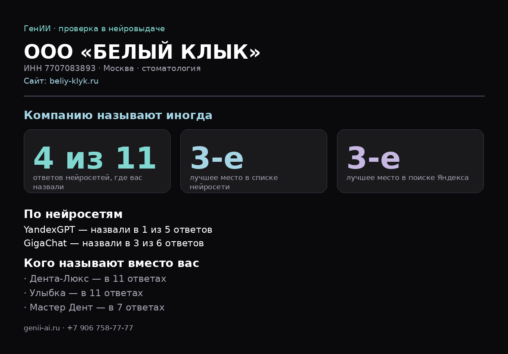

# Проверка компании в нейровыдаче

Телеграм-бот для менеджера: присылаешь ИНН — получаешь картинку с
разбором. Насколько часто нейросети называют компанию по запросам её
ниши, на каком месте она в поиске Яндекса и кого называют вместо неё.

Программа **не часть сайта** и на хостинге не крутится: она работает
на компьютере менеджера или на отдельном сервере.

## Что показывает



Три числа наверху:

* **сколько ответов из скольких** — в скольких ответах нейросетей
  компания вообще прозвучала;
* **лучшее место в списке нейросети** — нейросеть отвечает
  перечислением, и разница между первым и седьмым местом для клиента
  большая;
* **лучшее место в поиске Яндекса** — по тем же запросам ниши.

Ниже — разбивка по нейросетям и список тех, кого называют вместо
компании. Это главный аргумент в разговоре с клиентом.

## Как это устроено

Готового показателя «место в нейровыдаче» не существует: нейросеть не
выдаёт пронумерованный список, она просто называет несколько компаний
или не называет никого. Поэтому программа спрашивает сама.

1. **ИНН → карточка компании.** Справочник DaData отдаёт название,
   город и код ОКВЭД. Номер сначала проверяется по контрольным цифрам:
   менеджер вводит его руками, и опечатка выдала бы чужую компанию.
2. **Ищем сайт.** По запросу «название, город, официальный сайт».
   Справочники, соцсети и агрегаторы пропускаем: компания там есть
   почти всегда, но это не её сайт. Не нашли — дальше проверяем по
   названию.
3. **Составляем запросы.** Из отрасли и города: «Посоветуй, куда
   обратиться: стоматология, Москва». Спрашиваем так, как спросил бы
   клиент, — если спросить про саму компанию, нейросеть просто
   перескажет, что о ней знает.
4. **Задаём их YandexGPT и GigaChat** и смотрим, названа ли компания
   и какой по счёту.
5. **Проверяем обычный поиск** по тем же темам: место сайта в первой
   двадцатке, а если сайта нет — упоминание названия.
6. **Рисуем картинку** в цветах сайта и отправляем в телеграм.

## Что нужно завести

| Что | Где | Сколько стоит |
|---|---|---|
| Бот | @BotFather в телеграме, команда `/newbot` | бесплатно |
| Справочник по ИНН | dadata.ru, личный кабинет → API-ключ | бесплатно, 10 000 в сутки |
| YandexGPT и поиск | console.yandex.cloud | по расходу, около 30–60 копеек за проверку |
| GigaChat | developers.sber.ru/studio | у физлица есть бесплатный объём |

В Яндекс Облаке нужно создать сервисный аккаунт, выдать ему роли
`ai.languageModels.user` и `search-api.webSearch.user` и создать
API-ключ. Идентификатор каталога виден в адресной строке консоли.

Токен бота можно взять тот же, что принимает заявки с сайта: сайт
только отправляет сообщения и опросу не мешает.

## Запуск

1. Установить Python с python.org, при установке отметить галочку
   **Add Python to PATH**.
2. Скопировать `config.example.ini` в `config.ini` и вписать ключи.
3. Windows — запустить `zapusk.bat` двойным щелчком.
   Остальные — `pip install -r requirements.txt`, затем `python bot.py`.
4. Написать боту в телеграме ИНН.

Пока окно программы открыто, бот отвечает. Закрыли — молчит. Чтобы
работал всегда, программу ставят на сервер; для начала хватает и
компьютера менеджера.

Проверить ключи, не поднимая бота:

```
python proverka.py 7707083893
```

Ошибки видно сразу в окне, картинка ляжет в папку `otchety`.

## Ограничения, о которых надо знать

* **Ответ нейросети меняется от раза к разу.** Одна и та же компания
  в понедельник может попасть в список, а в среду нет. Поэтому
  вопросов задаётся дюжина: важна доля, а не отдельный ответ.
* **Нейросети выдумывают названия.** Температура выставлена низкой,
  чтобы этого было меньше, но полностью это не лечится.
* **Список «кого называют вместо вас» — подсказка, а не точные
  данные.** Он собирается разбором нумерованных строк в ответе, и
  туда может попасть лишнее.
* **Отрасль берётся из ОКВЭД**, а он у многих компаний формальный.
  Если запросы вышли мимо, стоит поправить `nejroanaliz/queries.py` —
  список тем лежит в начале файла понятными словами.
* **Ключи в репозиторий не попадают**: `config.ini` в `.gitignore`.

## Из чего состоит

```
bot.py                    телеграм-бот
proverka.py               проверка одной компании из командной строки
config.example.ini        образец настроек
nejroanaliz/
  inn.py                  проверка ИНН по контрольным цифрам
  company.py              карточка компании из справочника
  queries.py              составление запросов
  search_yandex.py        поиск Яндекса: сайт и позиции
  ai_yandex.py            YandexGPT
  ai_gigachat.py          GigaChat
  matching.py             поиск упоминания названия в чужом тексте
  report.py               сборка отчёта и отрисовка картинки
  run.py                  весь проход целиком
```
